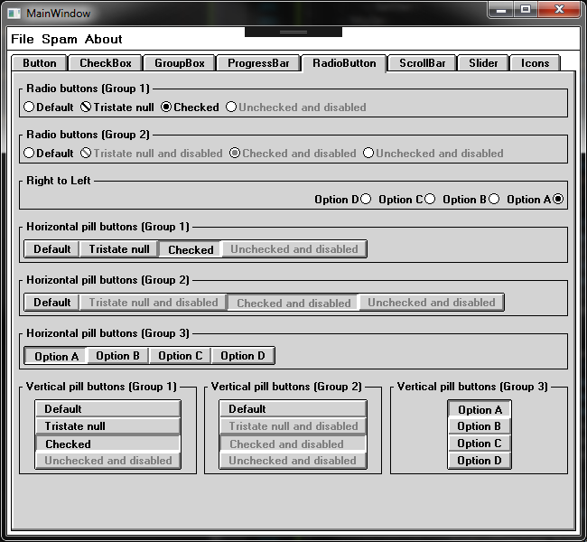
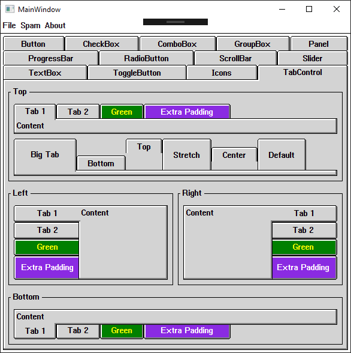
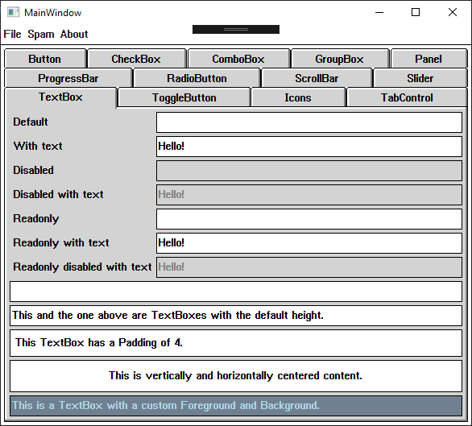
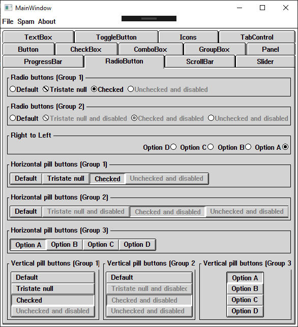

# WPFWin3
## A theme for WPF inspired by Windows 3.1

It's just something I like to pick up sometimes when I have time to burn.  There are many things left to be done.

## Typeface

WPF lacks the ability to load raster font files, so the default system font "System" (VGASYS.FON) is not usable.  Instead, I have recreated it as a TrueType font using an online pixel font editor [BitFontMaker2](http://www.pentacom.jp/pentacom/bitfontmaker2/).  There are kerning issues with letters such as X and Y; to compensate, the letter spacing is set to 1 pixel instead of 2 as it was in the original.

The BitFontMaker2 document is saved as a JSON file and is kept along with the TTF file in the Fonts folder.

## Screenshots

