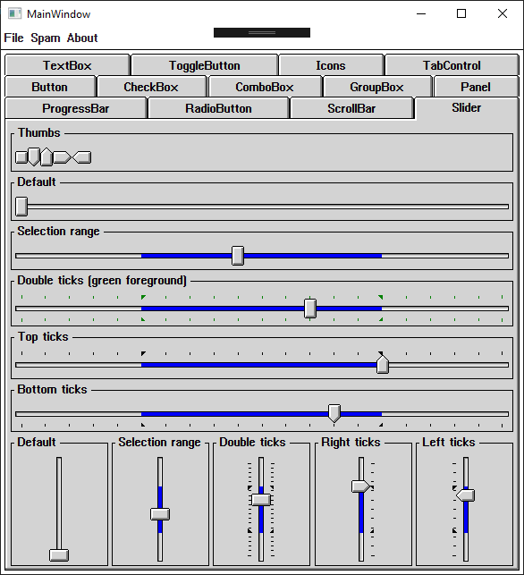

# WPFWin3
## A theme for WPF inspired by Windows 3.1

It's just something I like to pick up sometimes when I have time to burn.  There are many things left to be done.

Because WPF lacks the ability to load raster fonts, I am not able to load the default system font SYSTEM.FON.  As an alternative, I had to fallback to using MS Sans Serif with some special textblock rendering settings to disable antialiasing and to get it pixel-perfect.

### Here, have some screenshots:

